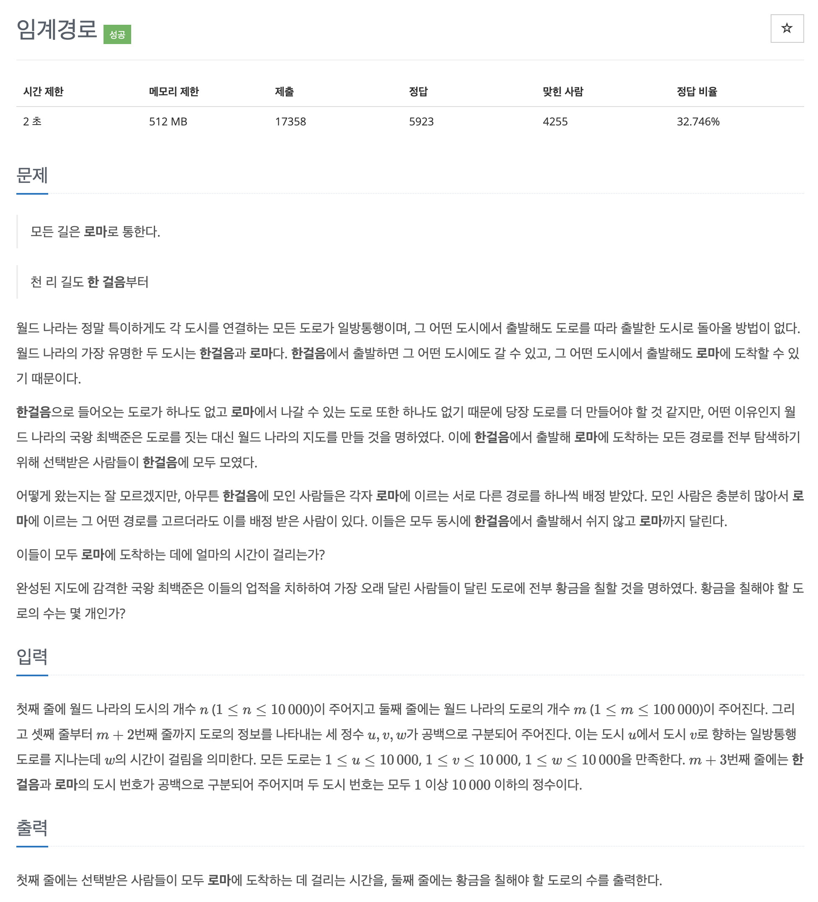

# 문제 058. 임계 경로 구하기



### 문제 분석

- 출발 도시와 도착 도시가 주어지기 때문에 일반적인 위상 정렬이 아닌 시작점을 출발 도시로 지정하고 위상 정렬을 수행하면 출발 도시에서 도착 도시까지 거치는 모든 도시와 관련된 임계 경로값을 구할 수 있다.
- 단, 이 문제의 핵심은 1분도 쉬지 않고 달려야 하는 도로의 수를 구하는 것인데, 이를 해결하려면 에지 뒤집기라는 아이디어가 필요하다.

### 문제 풀이

1. 인접 리스트에 노드 데이터를 저장하고, 진입 차수 배열 값을 업데이트한다.  
   이때 에지의 방향이 반대인 역방향 인접 리스트도 함께 생성하고 저장한다.

2. 시작 도시에서 위상 정렬을 수행해 각 도시와 관련된 임계 경로를 저장한다.

3. 도착 도시에서 역방향으로 위상 정렬을 수행한다.  
   이때 '이 도시의 임계 경로값 + 도로 시간(에지) == 이전 도시의 임계 경로값'일 경우에는 이 도로를 1분도 쉬지 않고 달려야 하는 도로로 카운팅하고, 이 도시를 큐에 삽입하는 로직으로 구현해야 한다.

   > **노드를 큐에 삽입할 때 주의할 점!**  
   >  1분도 쉬지 않고 달려야 하는 도로로 이어진 노드와 연결된 다른 도로만이 1분도 쉬지 않고 달려야 하는 도로의 후보가 될 수 있으므로 이 매커니즘을 바탕으로 노드를 큐에 삽입해야 한다. 또한 중복으로 도로를 카운트하지 않기 위해 이미 방문한 적이 있는 노드는 큐에 넣어 주지 않는다.

4. 도착 도시의 임계 경로값과 1분도 쉬지 않고 달려야 하는 도로의 수를 출력

### 문제집 풀이

```java
메모리 49936KB, 시간 392ms

class dNode {
	int targetNode;
	int value;

	dNode(int targetNode, int value) {
		this.targetNode = targetNode;
		this.value = value;
	}
}

public class P1948_임계경로 {

	public static void main(String[] args) throws IOException {
		BufferedReader br = new BufferedReader(new InputStreamReader(System.in));
		int N = Integer.parseInt(br.readLine());	// 월드 나라의 도시의 개수
		int M = Integer.parseInt(br.readLine());	// 월드 나라의 도로의 개수

		ArrayList<ArrayList<dNode>> A = new ArrayList<>();			// 정방향 인접리스트
		ArrayList<ArrayList<dNode>> reverseA = new ArrayList<>();	// 역방향 인접리스트
		for(int i=0; i<=N; i++) {
			A.add(new ArrayList<>());
			reverseA.add(new ArrayList<>());
		}

		int[] indegree = new int [N+1];		// 진입 차수 배열
		for(int i=0; i<M; i++) {
			StringTokenizer st = new StringTokenizer(br.readLine());
			int S = Integer.parseInt(st.nextToken());
			int E = Integer.parseInt(st.nextToken());
			int V = Integer.parseInt(st.nextToken());
			A.get(S).add(new dNode(E, V));			// 정방향 에지 정보 저장
			reverseA.get(E).add(new dNode(S, V));	// 역방향 에지 정보 저장
			indegree[E]++;							// 진입 차수 배열 초기 데이터 저장
		}

		StringTokenizer st = new StringTokenizer(br.readLine());
		int startDosi = Integer.parseInt(st.nextToken());
		int endDosi = Integer.parseInt(st.nextToken());

		// 위상 정렬
		Queue<Integer> queue = new LinkedList<>();
		queue.offer(startDosi);
		int[] result = new int [N+1];

		while(!queue.isEmpty()) {
			int now = queue.poll();
			for(dNode next : A.get(now)) {
				indegree[next.targetNode]--;
				result[next.targetNode] = Math.max(result[next.targetNode], result[now] + next.value);

				if(indegree[next.targetNode] == 0) {
					queue.offer(next.targetNode);
				}
			}
		}

		// reverse 위상 정렬
		int resultCount = 0;
		boolean[] visited = new boolean [N+1];
		queue = new LinkedList<>();
		queue.offer(endDosi);
		visited[endDosi] = true;

		while(!queue.isEmpty()) {
			int now = queue.poll();
			for(dNode next : reverseA.get(now)) {
				// 1분도 쉬지 않는 도로 체크하기
				if(result[next.targetNode] + next.value == result[now]) {
					resultCount++;

					// 중복 카운트 방지를 위해 이미 방문한 적이 있는 노드 제외하기
					if(visited[next.targetNode] == false) {
						visited[next.targetNode] = true;
						queue.offer(next.targetNode);
					}
				}
			}
		}

		// 출력
		System.out.println(result[endDosi]);
		System.out.println(resultCount);
	}
}
```
