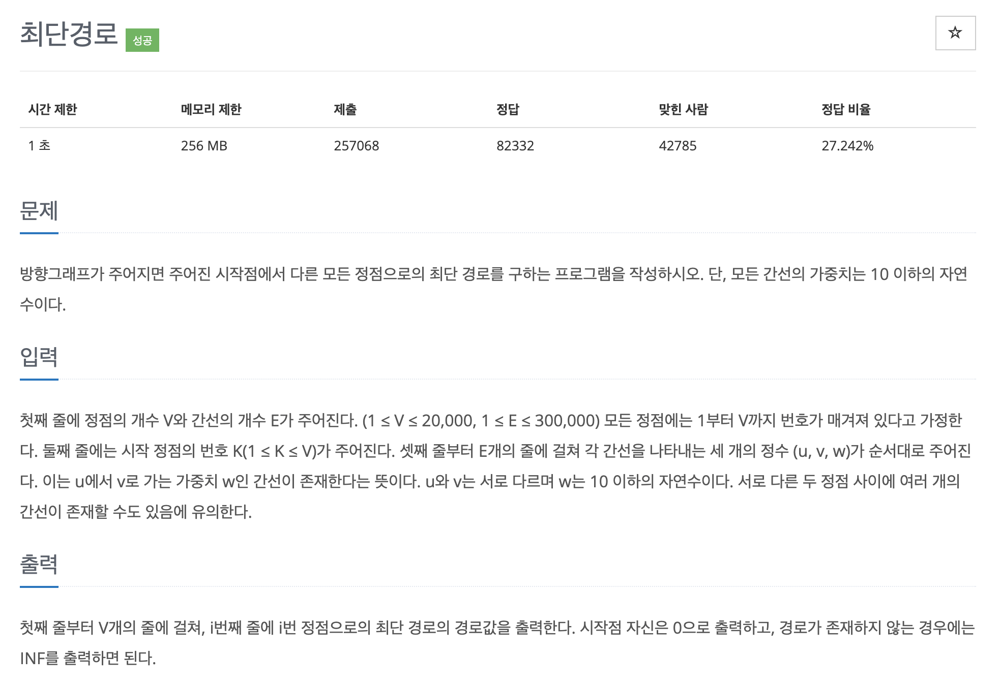

# 문제 059. 최단 경로 구하기



### 내가 작성한 풀이

```java
메모리 111468KB, 시간 820ms

class Node implements Comparable<Node> {
	int v;
	int w;

	Node(int v, int w) {
		this.v = v;
		this.w = w;
	}

	@Override
	public int compareTo(Node o) {
		return this.w - o.w;
	}
}

public class P1753_최단경로 {

	public static void main(String[] args) throws IOException {
		BufferedReader br = new BufferedReader(new InputStreamReader(System.in));
		StringTokenizer st = new StringTokenizer(br.readLine());
		int V = Integer.parseInt(st.nextToken());		// 정점의 개수
		int E = Integer.parseInt(st.nextToken());		// 간선의 개수
		int start = Integer.parseInt(br.readLine());	// 시작 정점의 번호

		ArrayList<Node>[] adj = new ArrayList [V+1];	// 인접리스트
		for(int i=1; i<=V; i++) {
			adj[i] = new ArrayList<Node>();
		}

		for(int i=0; i<E; i++) {
			st = new StringTokenizer(br.readLine());
			int u = Integer.parseInt(st.nextToken());	// u에서 v로 가는 가중치 w인 간선
			int v = Integer.parseInt(st.nextToken());
			int w = Integer.parseInt(st.nextToken());

			adj[u].add(new Node(v, w));
		}

		// 최단 거리 배열
		int[] shortDist = new int [V+1];
		for(int i=1; i<=V; i++) {
			shortDist[i] = Integer.MAX_VALUE;
		}

		// 최단 경로 탐색
		PriorityQueue<Node> queue = new PriorityQueue<Node>();		// 우선순위 큐
		queue.add(new Node(start, 0));
		shortDist[start] = 0;

		while(!queue.isEmpty()) {
			Node now = queue.poll();

			if(now.w > shortDist[now.v]) {
				continue;
			}

			for(Node next : adj[now.v]) {
				int nextW = now.w + next.w;

				if(nextW < shortDist[next.v]) {
					shortDist[next.v] = nextW;
					queue.add(new Node(next.v, nextW));
				}
			}
		}

		// 출력
		for(int i=1; i<=V; i++) {
			if(shortDist[i] == Integer.MAX_VALUE) {
				System.out.println("INF");
			} else {
				System.out.println(shortDist[i]);
			}
		}
	}
}
```

### 문제집 풀이

```java
메모리 111860KB, 시간 812ms

class Edge implements Comparable<Edge> {
	int vertex, value;

	Edge(int vertex, int value) {
		this.vertex = vertex;
		this.value = value;
	}

	@Override
	public int compareTo(Edge e) {
		if(this.value > e.value) {
			return 1;
		}

		return -1;
	}
}

public class P1753_최단경로 {

	static int V, E, K;
	static int[] distance;
	static boolean[] visited;
	static ArrayList<Edge>[] list;
	static PriorityQueue<Edge> q = new PriorityQueue<>();

	public static void main(String[] args) throws IOException {
		BufferedReader br = new BufferedReader(new InputStreamReader(System.in));
		StringTokenizer st = new StringTokenizer(br.readLine());
		V = Integer.parseInt(st.nextToken());
		E = Integer.parseInt(st.nextToken());
		K = Integer.parseInt(br.readLine());

		distance = new int [V+1];
		visited = new boolean [V+1];
		list = new ArrayList [V+1];

		for(int i=1; i<=V; i++) {
			list[i] = new ArrayList<Edge>();
		}

		for(int i=0; i<=V; i++) {
			distance[i] = Integer.MAX_VALUE;
		}

		for(int i=0; i<E; i++) {		// 가중치가 있는 인접 리스트 초기화하기
			st = new StringTokenizer(br.readLine());
			int u = Integer.parseInt(st.nextToken());
			int v = Integer.parseInt(st.nextToken());
			int w = Integer.parseInt(st.nextToken());
			list[u].add(new Edge(v, w));
		}

		q.add(new Edge(K, 0));		// K를 시작점으로 설정하기
		distance[K] = 0;

		while(!q.isEmpty()) {
			Edge current = q.poll();
			int c_v = current.vertex;

			if(visited[c_v]) {		// 이미 방문한 적이 있는 노드는 다시 큐에 넣지 않음
				continue;
			}

			visited[c_v] = true;

			for(int i=0; i<list[c_v].size(); i++) {
				Edge tmp = list[c_v].get(i);
				int next = tmp.vertex;
				int value = tmp.value;

				if(distance[next] > distance[c_v] + value) {	// 최소 거리로 업데이트하기
					distance[next] = value + distance[c_v];
					q.add(new Edge(next, distance[next]));
				}
			}
		}

		for(int i=1; i<=V; i++) {		// 거리 배열 출력하기
			if(visited[i]) {
				System.out.println(distance[i]);
			} else {
				System.out.println("INF");
			}
		}
	}
}
```
