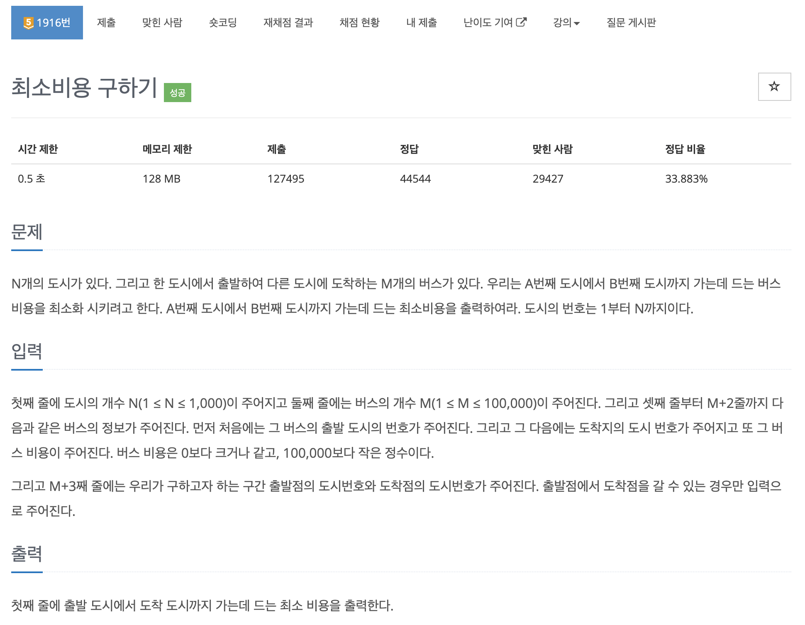

# 문제 060. 최소 비용 구하기



### 내가 작성한 풀이

```java
메모리 51020KB, 시간 480ms

class Node implements Comparable<Node>{
	int node;
	int price;

	Node(int node, int price) {
		this.node = node;
		this.price = price;
	}

	@Override
	public int compareTo(Node o) {
		return this.price - o.price;
	}
}

public class P1916_최소비용구하기 {

	public static void main(String[] args) throws IOException {
		BufferedReader br = new BufferedReader(new InputStreamReader(System.in));
		StringTokenizer st;

		int N = Integer.parseInt(br.readLine());	// 도시의 개수
		int M = Integer.parseInt(br.readLine());	// 버스의 개수

		// 버스 노선 연결
		List<Node>[] adj = new ArrayList [N+1];
		for(int i=1; i<=N; i++) {
			adj[i] = new ArrayList<Node>();
		}

		for(int i=0; i<M; i++) {
			st = new StringTokenizer(br.readLine());
			int start = Integer.parseInt(st.nextToken());
			int end = Integer.parseInt(st.nextToken());
			int price = Integer.parseInt(st.nextToken());

			adj[start].add(new Node(end, price));
		}

		st = new StringTokenizer(br.readLine());
		int startPoint = Integer.parseInt(st.nextToken());	// 출발점의 도시번호
		int endPoint = Integer.parseInt(st.nextToken());	// 도착점의 도시번호

		int[] minPriceArr = new int [N+1];		// 해당 인덱스 위치까지 도착하는데 드는 최소 비용을 관리
		for(int i=0; i<=N; i++) {
			minPriceArr[i] = Integer.MAX_VALUE;
		}

		// 도착지까지 가는데 드는 최소 비용 계산
		PriorityQueue<Node> queue = new PriorityQueue<Node>();
		queue.add(new Node(startPoint, 0));
		minPriceArr[startPoint] = 0;

		while(!queue.isEmpty()) {
			Node now = queue.poll();

			if(now.price > minPriceArr[now.node]) {
				continue;
			}

			for(Node next : adj[now.node]) {
				int nextPrice = now.price + next.price;

				if(nextPrice < minPriceArr[next.node]) {
					minPriceArr[next.node] = nextPrice;
					queue.add(new Node(next.node, nextPrice));
				}
			}
		}

		System.out.println(minPriceArr[endPoint]);
	}
}
```

### 문제집 풀이

```java
메모리 50972KB, 시간 500ms


class Node implements Comparable<Node> {
	int targetNode;
	int value;

	Node(int targetNode, int value) {
		this.targetNode = targetNode;
		this.value = value;
	}

	@Override
	public int compareTo(Node o) {
		return value - o.value;
	}
}

public class P1916_최소비용구하기 {

	static int N, M;
	static ArrayList<Node>[] list;
	static int[] dist;
	static boolean[] visited;

	public static void main(String[] args) throws IOException {
		BufferedReader br = new BufferedReader(new InputStreamReader(System.in));
		BufferedWriter bw = new BufferedWriter(new OutputStreamWriter(System.out));
		StringTokenizer st;

		N = Integer.parseInt(br.readLine());
		M = Integer.parseInt(br.readLine());

		list = new ArrayList [N+1];
		for(int i=0; i<=N; i++) {
			list[i] = new ArrayList<Node>();
		}

		dist = new int [N+1];
		Arrays.fill(dist, Integer.MAX_VALUE);	// 거리 배열을 충분히 큰 수로 초기화

		visited = new boolean [N+1];

		for(int i=0; i<M; i++) {		// 주어진 그래프의 에지를 인접 리스트 자료구조에 넣기
			st = new StringTokenizer(br.readLine());
			int start = Integer.parseInt(st.nextToken());
			int end = Integer.parseInt(st.nextToken());
			int weight = Integer.parseInt(st.nextToken());

			list[start].add(new Node(end, weight));
		}

		st = new StringTokenizer(br.readLine());
		int startIndex = Integer.parseInt(st.nextToken());
		int endIndex = Integer.parseInt(st.nextToken());

		bw.write(dijkstra(startIndex, endIndex) + " \n");	// 다익스트라 알고리즘 수행
		bw.flush();
		bw.close();
		br.close();
	}

	/**
	 * 다익스트라 알고리즘
	 */
	private static int dijkstra(int start, int end) {
		PriorityQueue<Node> pq = new PriorityQueue<Node>();
		pq.offer(new Node(start, 0));
		dist[start] = 0;

		while(!pq.isEmpty()) {
			Node nowNode = pq.poll();
			int now = nowNode.targetNode;

			if(!visited[now]) {
				visited[now] = true;
				for(Node n : list[now]) {
					// 선택노드 + 비용 < 타깃노드일 때 값을 업데이트
					if(!visited[n.targetNode] && dist[n.targetNode] > dist[now] + n.value) {
						dist[n.targetNode] = dist[now] + n.value;
						pq.add(new Node(n.targetNode, dist[n.targetNode]));
					}
				}
			}
		}

		return dist[end];
	}
}
```
