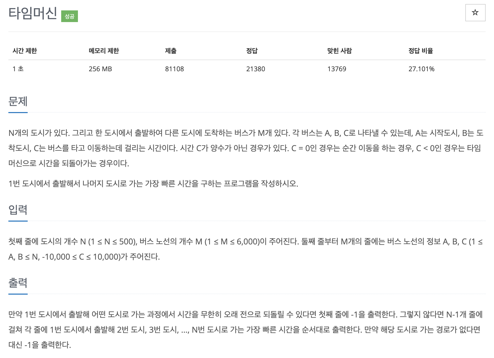

# 문제 062. 타임머신으로 빨리 가기



### 문제집 풀이

```java
메모리 19592KB, 시간 256ms

class Edge {
	int start, end, time;

	Edge(int start, int end, int time) {
		this.start = start;
		this.end = end;
		this.time = time;
	}
}

public class P11657_타임머신 {

	public static void main(String[] args) throws IOException {
		BufferedReader br = new BufferedReader(new InputStreamReader(System.in));
		BufferedWriter bw = new BufferedWriter(new OutputStreamWriter(System.out));

		StringTokenizer st = new StringTokenizer(br.readLine());
		int N = Integer.parseInt(st.nextToken());	// 도시의 개수
		int M = Integer.parseInt(st.nextToken());	// 버스 노선의 개수

		// 에지 리스트로 그래프 구현
		Edge[] edges = new Edge [M+1];
		for(int i=0; i<M; i++) {
			st = new StringTokenizer(br.readLine());
			int start = Integer.parseInt(st.nextToken());	// 시작도시
			int end = Integer.parseInt(st.nextToken());		// 도착도시
			int time = Integer.parseInt(st.nextToken());	// 걸리는 시간

			edges[i] = new Edge(start, end, time);
		}

		// 최단 경로 배열 초기화
		long[] distance = new long [N+1];
		Arrays.fill(distance, Integer.MAX_VALUE);

		// 모든 에지를 확인해 정답 배열 업데이트
		distance[1] = 0;
		for(int i=1; i<N; i++) {		// N보다 1개 적은 수만큼 반복
			for(int j=0; j<M; j++) {
				Edge edge = edges[j];

				// 출발 노드가 방문한 적이 없는 노드일 때 값을 업데이트하지 않는다.
				if(distance[edge.start] == Integer.MAX_VALUE) {
					continue;
				}

				// 더 작은 최단 거리가 있을 때 업데이트
				if(distance[edge.end] > distance[edge.start] + edge.time) {
					distance[edge.end] = distance[edge.start] + edge.time;
				}
			}
		}

		// 음수 사이클 확인
		boolean mCycle = false;
		for(int i=0; i<M; i++) {
			Edge edge = edges[i];
			if(distance[edge.start] != Integer.MAX_VALUE && distance[edge.end] > distance[edge.start] + edge.time) {
				mCycle = true;
			}
		}

		if(!mCycle) {
			// 음수 사이클이 없을 때
			for(int i=2; i<=N; i++) {
				if(distance[i] == Integer.MAX_VALUE) {
					bw.append(-1 + "\n");
				} else {
					bw.append(distance[i] + "\n");
				}
			}
		} else {
			// 음수 사이클이 있을 때
			System.out.println("-1");
		}

		bw.flush();
		bw.close();
	}
}
```
