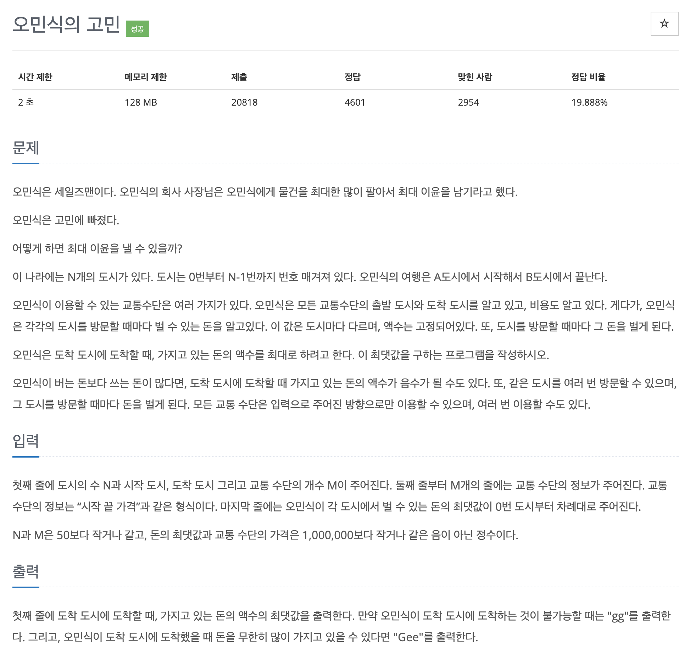

# 문제 063. 세일즈맨의 고민



### 변형된 벨만-포드 알고리즘

1. 모든 에지와 관련된 정보를 가져와 다음 조건에 따라 거리 배열의 값을 업데이트한다.
   - 시작 도시가 방문한 적이 없는 도시일 때 (시작도시 == MIN) 업데이트하지 않는다.
   - 시작 도시가 양수 사이클과 연결된 도시일 때 (도착도시 == MAX) 도착 도시도 양수 사이클과 연결된 도시로 업데이트한다.
   - '도착 도시값 < 시작 도시값 + 도착 도시 수입 - 에지 가중치'일 때 더 많이 벌 수 있는 새로운 경로로 도착한 것이므로 값을 업데이트한다.
2. 노드보다 충분히 많은 값(N+100)으로 1을 반복한다.

### 문제집 풀이

```java
메모리 14316KB, 시간 104ms

class Edge {
	int start, end, price;

	Edge(int start, int end, int price) {
		this.start = start;
		this.end = end;
		this.price = price;
	}
}

public class P1219_세일즈맨의고민 {

	public static void main(String[] args) throws IOException {
		BufferedReader br = new BufferedReader(new InputStreamReader(System.in));
		StringTokenizer st = new StringTokenizer(br.readLine());
		int N = Integer.parseInt(st.nextToken());		// 도시 수
		int sCity = Integer.parseInt(st.nextToken());	// 시작 도시
		int eCity = Integer.parseInt(st.nextToken());	// 도착 도시
		int M = Integer.parseInt(st.nextToken());		// 교통 수단 개수

		// 교통 수단 정보
		Edge[] edges = new Edge [M];
		for(int i=0; i<M; i++) {
			st = new StringTokenizer(br.readLine());
			int start = Integer.parseInt(st.nextToken());
			int end = Integer.parseInt(st.nextToken());
			int price = Integer.parseInt(st.nextToken());
			edges[i] = new Edge(start, end, price);
		}

		// 각 도시에서 벌 수 있는 돈
		long[] cityMoney = new long [N];
		st = new StringTokenizer(br.readLine());
		for(int i=0; i<N; i++) {
			cityMoney[i] = Long.parseLong(st.nextToken());
		}

		long[] distance = new long [N];			// 최단 거리 배열
		Arrays.fill(distance, Long.MIN_VALUE);
		distance[sCity] = cityMoney[sCity];		// 변형된 벨만-포드 알고리즘 수행

		// 양수 사이클이 전파되도록 충분히 큰 수로 반복하기
		for(int i=0; i<=N+100; i++) {
			for(int j=0; j<M; j++) {
				int start = edges[j].start;
				int end = edges[j].end;
				int price = edges[j].price;

				// 출발 노드가 방문하지 않은 노드이면 pass
				if(distance[start] == Long.MIN_VALUE) {
					continue;
				}

				// 출발 노드가 양수 사이클에 연결된 노드라면 종료 노드도 연결 노드로 업데이트
				else if (distance[start] == Long.MAX_VALUE) {
					distance[end] = Long.MAX_VALUE;
				}

				// 더 많은 돈을 벌 수 있는 새로운 경로가 발견됐을 때 새로운 경로값으로 업데이트
				else if (distance[end] < distance[start] + cityMoney[end] - price) {
					distance[end] = distance[start] + cityMoney[end] - price;

					// N-1번 반복 이후 업데이트되는 종료 노드는 양수 사이클 연결 노드로 변경
					if(i >= N-1) {
						distance[end] = Long.MAX_VALUE;
					}
				}
			}
		}

		if(distance[eCity] == Long.MIN_VALUE) {		// 도착 불가능
			System.out.println("gg");
		} else if (distance[eCity] == Long.MAX_VALUE) {		// 양수 사이클에 연결돼 무한대 돈을 벌 수 있을 때
			System.out.println("Gee");
		} else {
			System.out.println(distance[eCity]);
		}
	}
}
```
