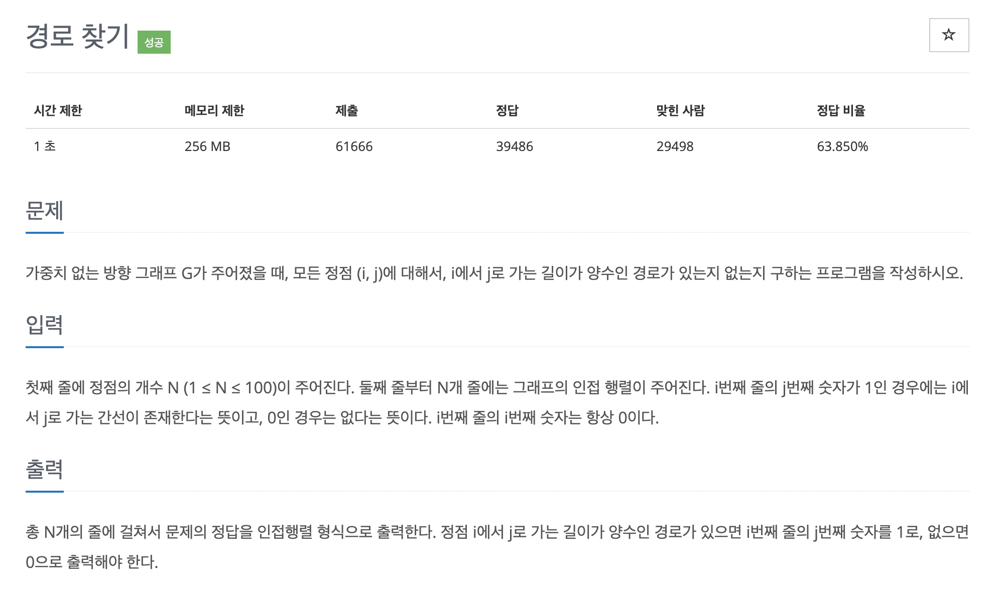

# 문제 065. 경로 찾기



### 내가 작성한 풀이

```java
메모리 17636KB, 시간 184ms

public class P11403_경로찾기 {

	public static void main(String[] args) throws IOException {
		BufferedReader br = new BufferedReader(new InputStreamReader(System.in));
		BufferedWriter bw = new BufferedWriter(new OutputStreamWriter(System.out));
		StringTokenizer st;

		int N = Integer.parseInt(br.readLine());	// 정점의 개수

		int[][] adj = new int [N][N];	// 인접행렬
		for(int i=0; i<N; i++) {
			st = new StringTokenizer(br.readLine());
			for(int j=0; j<N; j++) {
				adj[i][j] = Integer.parseInt(st.nextToken());
			}
		}

		// 플로이드-워셜
		for(int k=0; k<N; k++) {
			for(int s=0; s<N; s++) {
				for(int e=0; e<N; e++) {
					// 이미 s -> e 로 갈 수 있다고 판단했으면 pass
					if(adj[s][e] == 1) {
						continue;
					}

					// s -> k 로 갈 수 있고 k -> e로 갈 수 있다면, s -> e 로도 갈 수 있음
					adj[s][e] = adj[s][k] * adj[k][e];
				}
			}
		}

		// 출력
		for(int i=0; i<N; i++) {
			for(int j=0; j<N; j++) {
				bw.append(adj[i][j] + " ");
			}
			bw.append("\n");
		}

		bw.flush();
		bw.close();
	}
}
```

### 문제집 풀이

```java
메모리 18332KB, 시간 272ms

public class P11403_경로찾기 {

	private static BufferedReader br = new BufferedReader(new InputStreamReader(System.in));

	public static void main(String[] args) throws IOException {
		int N = Integer.parseInt(br.readLine());

		int[][] distance = new int [N][N];
		for(int i=0; i<N; i++) {	// 입력되는 인접 행렬의 값을 그대로 저장
			StringTokenizer st = new StringTokenizer(br.readLine());
			for(int j=0; j<N; j++) {
				int v = Integer.parseInt(st.nextToken());
				distance[i][j] = v;
			}
		}

		// 변형된 플로이드-워셜 알고리즘 수행
		for(int k=0; k<N; k++) {
			for(int i=0; i<N; i++) {
				for(int j=0; j<N; j++) {
					if(distance[i][k] == 1 && distance[k][j] == 1) {
						distance[i][j] = 1;
					}
				}
			}
		}

		for(int i=0; i<N; i++) {
			for(int j=0; j<N; j++) {
				System.out.print(distance[i][j] + " ");
			}
			System.out.println();
		}
	}
}
```
