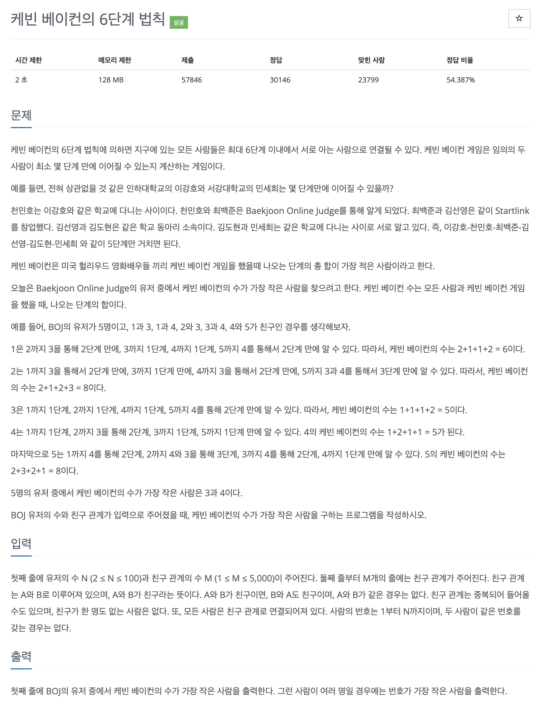

# 문제 066. 케빈 베이컨의 6단계 법칙



### 내가 작성한 풀이

- 플로이드-워셜 순서 잘 기억하기 : 경유지 k, 출발노드 s, 도착노드 e 순서!!

```java
메모리 14620KB, 시간 132ms

public class P1389_케빈베이컨의6단계법칙 {

	public static void main(String[] args) throws IOException {
		BufferedReader br = new BufferedReader(new InputStreamReader(System.in));
		StringTokenizer st = new StringTokenizer(br.readLine());
		int N = Integer.parseInt(st.nextToken());	// 유저의 수
		int M = Integer.parseInt(st.nextToken());	// 친구 관계의 수

		int[][] adj = new int [N+1][N+1];
		for(int i=1; i<=N; i++) {
			for(int j=1; j<=N; j++) {
				if(i == j) {
					adj[i][j] = 0;
				} else {
					adj[i][j] = N * M + 1;	// 충분히 큰 값으로 설정
				}
			}
		}

		// 친구 관계 설정
		for(int i=0; i<M; i++) {
			st = new StringTokenizer(br.readLine());
			int p1 = Integer.parseInt(st.nextToken());
			int p2 = Integer.parseInt(st.nextToken());
			adj[p1][p2] = adj[p2][p1] = 1;
		}

		// 플로이드-워셜
		for(int k=1; k<=N; k++) {
			for(int s=1; s<=N; s++) {
				for(int e=1; e<=N; e++) {
					adj[s][e] = Math.min(adj[s][e], adj[s][k] + adj[k][e]);
				}
			}
		}

		// 케빈 베이컨의 수가 가장 적은 사람 계산
		int idx = 0;
		int min = Integer.MAX_VALUE;

		for(int i=1; i<=N; i++) {
			int total = 0;

			for(int j=1; j<=N; j++) {
				if(i == j) {
					continue;
				}

				total += adj[i][j];
			}

			if(total < min) {
				min = total;
				idx = i;
			}
		}

		System.out.println(idx);
	}
}
```

### 문제집 풀이

```java
메모리 14512KB, 시간 124ms

public class P1389_케빈베이컨의6단계법칙 {

	private static BufferedReader br = new BufferedReader(new InputStreamReader(System.in));

	public static void main(String[] args) throws IOException {
		StringTokenizer st = new StringTokenizer(br.readLine());
		int N = Integer.parseInt(st.nextToken());
		int M = Integer.parseInt(st.nextToken());

		int[][] distance = new int [N+1][N+1];
		for(int i=1; i<=N; i++) {
			for(int j=1; j<=N; j++) {
				if(i == j) {
					distance[i][j] = 0;
				} else {
					distance[i][j] = 10000001;	// 충분히 큰 수로 저장
				}
			}
		}

		for(int i=0; i<M; i++) {	// 친구 관계이므로 양방향 가중치를 1로 저장하기
			st = new StringTokenizer(br.readLine());
			int s = Integer.parseInt(st.nextToken());
			int e = Integer.parseInt(st.nextToken());
			distance[s][e] = 1;
			distance[e][s] = 1;
		}

		for(int k=1; k<=N; k++) {		// 플로이드-워셜 알고리즘 수행하기
			for(int i=1; i<=N; i++) {
				for(int j=1; j<=N; j++) {
					if(distance[i][j] > distance[i][k] + distance[k][j]) {
						distance[i][j] = distance[i][k] + distance[k][j];
					}
				}
			}
		}

		int min = Integer.MAX_VALUE;
		int answer = -1;

		for(int i=1; i<=N; i++) {
			int temp = 0;

			for(int j=1; j<=N; j++) {
				temp = temp + distance[i][j];
			}

			if(min > temp) {
				min = temp;
				answer = i;
			}
		}

		System.out.println(answer);
	}
}
```
