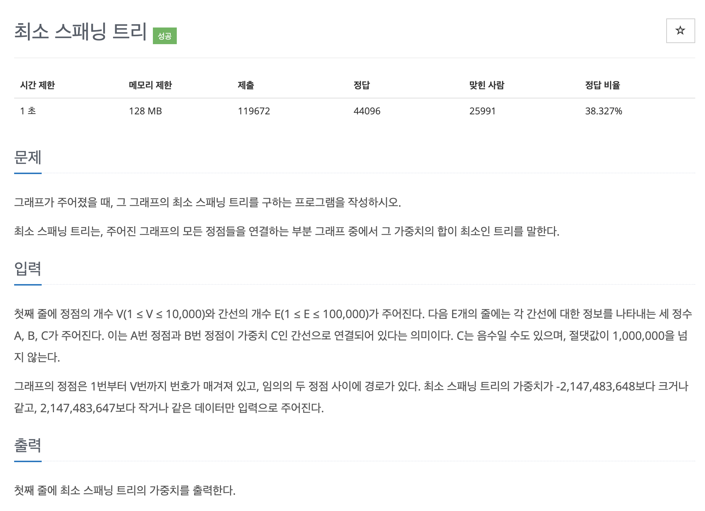

# 문제 067. 최소 신장 트리 구하기



### 문제집 풀이

```java
메모리 47628KB, 시간 468ms

class pEdge implements Comparable<pEdge> {
	int s;
	int e;
	int v;

	pEdge(int s, int e, int v) {
		this.s = s;
		this.e = e;
		this.v = v;
	}

	@Override
	public int compareTo(pEdge o) {
		// 가중치를 기준으로 오름차순 정렬하기 위해 compareTo() 함수 재정의
		return this.v - o.v;
	}
}

public class Main {

	static int[] parent;

	public static void main(String[] args) throws IOException {
		BufferedReader br = new BufferedReader(new InputStreamReader(System.in));
		StringTokenizer st = new StringTokenizer(br.readLine());
		int V = Integer.parseInt(st.nextToken());	// 정점의 개수 (노드 수)
		int E = Integer.parseInt(st.nextToken());	// 간선의 개수 (에지 수)

		PriorityQueue<pEdge> pq = new PriorityQueue<>();	// 자동정렬을 위해 우선순위 큐 자료구조 선택하기
		for(int i=0; i<E; i++) {
			st = new StringTokenizer(br.readLine());
			int s = Integer.parseInt(st.nextToken());
			int e = Integer.parseInt(st.nextToken());
			int v = Integer.parseInt(st.nextToken());
			pq.add(new pEdge(s, e, v));
		}

		parent = new int [V+1];	// 사이클 처리를 위한 유니온 파인드 배열
		for(int i=0; i<V; i++) {
			parent[i] = i;	// 배열의 인덱스로 해당 자리의 값을 초기화
		}

		int useEdge = 0;
		int result = 0;
		while(useEdge < V-1) {		// 연결한 에지의 개수가 V-1이 될 때까지 반복
			pEdge now = pq.poll();

			if(find(now.s) != find(now.e)) {	// 같은 부모가 아니라면 연결해도 사이클이 생기지 않음
				union(now.s, now.e);
				result = result + now.v;
				useEdge++;
			}
		}

		System.out.println(result);
	}

	/**
	 * union 연산 : 대표 노드끼리 연결하기
	 */
	private static void union(int a, int b) {
		a = find(a);
		b = find(b);

		if(a != b) {
			parent[b] = a;
		}
	}

	/**
	 * find 연산
	 */
	private static int find(int a) {
		if(a == parent[a]) {
			return a;
		}

		return parent[a] = find(parent[a]);		// 재귀 함수의 형태로 구현 -> 경로 압축 부분
	}
}
```
