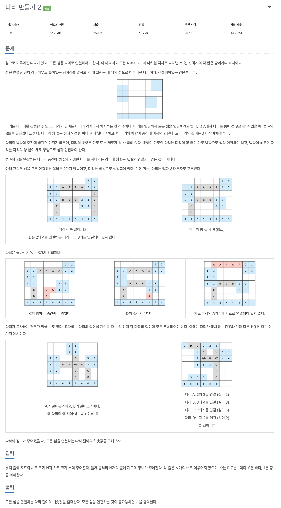

# 문제 068. 다리 만들기



### 문제 분석

- 데이터의 크기는 매우 작은 편이라 시간 복잡도 제약은 크지 않다.
- 주어진 지도에서 섬으로 표현된 값을 각각의 섬마다 다르게 표현해야 함
- 그 이후 각 섬의 모든 위치에서 다른 섬으로 연결할 수 있는 에지가 있는지 확인해 에지 리스트를 만든다.
- 이후 최소 신장 트리를 적용하여 문제 해결

### 풀이 과정

1. 지도의 정보를 2차원 배열에 저장하고 섬으로 표시된 모든 점에서 BFS를 실행해 섬을 구분 (상하좌우 네 방향으로 탐색)  
   → 방문한 적이 없고 바다가 아닐 때 같은 섬으로 인식
2. 모든 섬에서 상하좌우로 다리를 지어 다른 섬으로 연결할 수 있는지 확인  
   → 연결할 곳이 현재 섬이면 탐색 중단, 바다라면 탐색을 계속 수행  
   → 다른 섬을 만났을 때 다리의 길이가 2 이상이면 이 다리를 에지 리스트에 추가
3. 전 단계에서 수집한 모든 에지를 오름차순 정렬해 최소 신장 트리 알고리즘을 수행
4. 알고리즘이 끝나면 사용한 에지의 합을 출력

### 문제집 풀이

```java
메모리 17472KB, 시간 100ms

class bEdge implements Comparable<bEdge> {
	int s, e, v;

	bEdge(int s, int e, int v) {
		this.s = s;
		this.e = e;
		this.v = v;
	}

	@Override
	public int compareTo(bEdge o) {
		return this.v - o.v;
	}
}

public class P17472_다리만들기 {

	static int[] dr = {-1, 0, 1, 0};
	static int[] dc = {0, 1, 0, -1};

	static int N, M;
	static int[][] map;

	static int sNum;
	static boolean[][] visited;
	static ArrayList<int[]> mlist;

	static PriorityQueue<bEdge> pq;

	static int[] parent;

	public static void main(String[] args) throws IOException {
		BufferedReader br = new BufferedReader(new InputStreamReader(System.in));
		StringTokenizer st = new StringTokenizer(br.readLine());
		N = Integer.parseInt(st.nextToken());	// 지도의 세로 크기
		M = Integer.parseInt(st.nextToken());	// 지도의 가로 크기

		map = new int [N][M];
		for(int i=0; i<N; i++) {
			st = new StringTokenizer(br.readLine());
			for(int j=0; j<M; j++) {
				map[i][j] = Integer.parseInt(st.nextToken());	// 맵 정보 저장하기
			}
		}

		sNum = 1;
		visited = new boolean [N][M];
		ArrayList<ArrayList<int[]>> sumlist = new ArrayList<>();

		for(int i=0; i<N; i++) {		// 각 자리에서 BFS 탐색으로 섬들을 분리하기
			for(int j=0; j<M; j++) {
				if(map[i][j] != 0 && visited[i][j] != true) {
					// BFS(i, j) 모든 위치에서 BFS를 실행해 섬을 분리하기
					BFS(i, j);
					sNum++;
					sumlist.add(mlist);		// 결과를 sumlist 변수에 넣기
				}
			}
		}

		pq = new PriorityQueue<>();
		for(int i=0; i<sumlist.size(); i++) {	// 섬의 각 지점에서 만들 수 있는 모든 에지를 저장
			ArrayList<int[]> now = sumlist.get(i);

			for(int j=0; j<now.size(); j++) {
				int r = now.get(j)[0];
				int c = now.get(j)[1];
				int now_S = map[r][c];

				for(int d=0; d<4; d++) {	// 네 방향 검색하기
					int tempR = dr[d];
					int tempC = dc[d];
					int blenght = 0;

					while(r + tempR >= 0 && r + tempR < N && c + tempC >= 0 && c + tempC < M) {
						// 같은 섬이면 에지를 만들 수 없음
						if(map[r + tempR][c + tempC] == now_S) {
						 	break;
						} else if (map[r + tempR][c + tempC] != 0) {	// 같은 섬도 아니고 바다도 아니면
							if(blenght > 1) {	// 다른 섬 -> 길이가 1 초과할 때 에지로 더하기
								pq.add(new bEdge(now_S, map[r + tempR][c + tempC], blenght));
							}
							break;
						} else {	// 바다라면 다리 길이 연장하기
							blenght++;
						}

						if(tempR < 0) {
							tempR--;
						} else if (tempR > 0) {
							tempR++;
						} else if (tempC < 0) {
							tempC--;
						} else if (tempC > 0) {
							tempC++;
						}
					}
				}
			}
		}

		parent = new int [sNum];
		for(int i=0; i<parent.length; i++) {
			parent[i] = i;
		}

		int useEdge = 0;
		int result = 0;

		while(!pq.isEmpty()) {		// 최소 신장 트리 알고리즘 수행하기
			bEdge now = pq.poll();
			if(find(now.s) != find(now.e)) {	// 같은 부모가 아니라면 연결하기
				union(now.s, now.e);
				result = result + now.v;
				useEdge++;
			}
		}

		if(useEdge == sNum - 2) {
			System.out.println(result);
		} else {
			System.out.println(-1);
		}
	}

	private static void union(int a, int b) {	// union 연산 : 대표 노드끼리 연결하기
		a = find(a);
		b = find(b);

		if(a != b) {
			parent[b] = a;
		}
	}

	private static int find(int a) {	// find 연산
		if(a == parent[a]) {
			return a;
		}

		return parent[a] = find(parent[a]);		// 재귀 함수 형태로 구현 -> 경로 압축 부분
	}

	private static void BFS(int i, int j) {		// BFS를 이용해 연결된 섬 찾기
		Queue<int[]> queue = new LinkedList<>();
		mlist = new ArrayList<>();

		int[] start = {i, j};
		queue.add(start);
		mlist.add(start);
		visited[i][j] = true;
		map[i][j] = sNum;

		while(!queue.isEmpty()) {
			int[] now = queue.poll();
			int r = now[0];
			int c = now[1];

			for(int d=0; d<4; d++) {	// 네 방향 검색하기
				int tempR = dr[d];
				int tempC = dc[d];

				while(r + tempR >= 0 && r + tempR < N && c + tempC >= 0 && c + tempC < M) {
					// 현재 방문한 적이 없고 바다가 아니면 같은 섬으로 취급하기
					if(visited[r + tempR][c + tempC] == false && map[r + tempR][c + tempC] != 0) {
						addNode(r + tempR, c + tempC, queue);
					} else {
						break;
					}

					if(tempR < 0) {
						tempR--;
					} else if (tempR > 0) {
						tempR++;
					} else if (tempC < 0) {
						tempC--;
					} else if (tempC > 0) {
						tempC++;
					}
				}
			}
		}
	}

	// 특정 위치를 섬의 정보로 넣어주는 함수
	private static void addNode(int i, int j, Queue<int[]> queue) {
		map[i][j] = sNum;
		visited[i][j] = true;
		int[] temp = {i, j};
		mlist.add(temp);
		queue.add(temp);
	}
}
```
