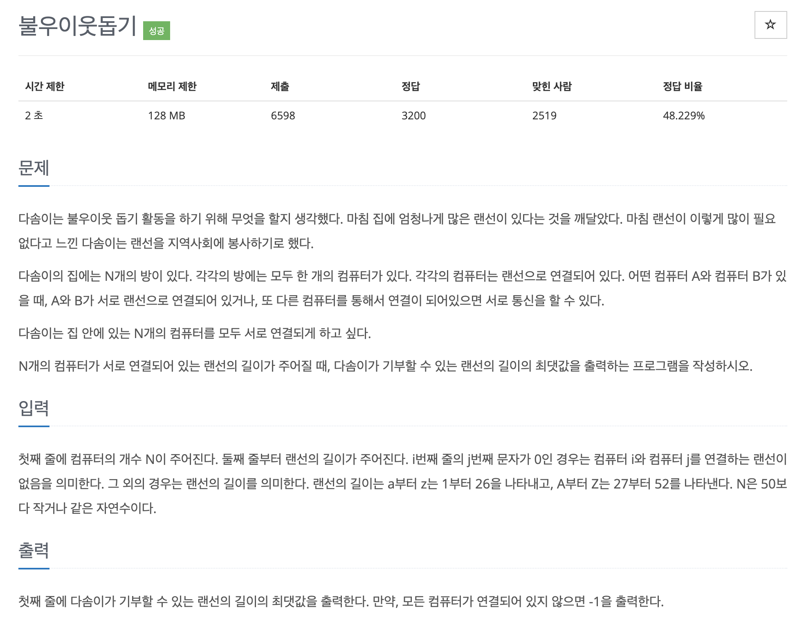

# 문제 069. 불우이웃돕기



### 문제 분석

- 인접 행렬의 형태로 데이터가 들어오기 때문에 이 부분을 최소 신장 트리가 가능한 형태로 변형하는 것이 핵심
- 먼저 문자열로 주어진 랜선의 길이를 숫자로 변형해 랜선의 총합을 저장
- 이때 i와 j가 같은 곳의 값은 같은 컴퓨터를 연결한다는 의미이므로 별도 에지로 저장하지 않고, 나머지 위치의 값들을 i → j로 가는 에지로 생성하고, 에지 리스트에 저장하면 최소 신장 트리 문제로 변형할 수 있음

### 풀이 과정

1. 입력 데이터의 정보를 배열에 저장한다. 입력으로 주어진 문자열을 숫자로 변환해 총합으로 저장한다.  
   소문자는 '현재 문자 - 'a' + 1', 대문자는 '현재 문자 - 'A' + 27'로 변환한다.  
   i와 j가 다른 경우에는 다른 컴퓨터를 연결하는 랜선이므로 에지 리스트에 저장한다.
2. 저장된 에지 리스트를 바탕으로 최소 신장 트리 알고리즘을 수행한다.
3. 최소 신장 트리의 결괏값이 다솜이가 최소한으로 필요한 랜선 길이이므로 처음 저장해 둔 랜선의 총합에서 최소 신장 트리의 결괏값을 뺀 값을 정답으로 출력한다.  
   단, 최소 신장 트리에서 사용한 에지 개수가 N-1이 아닌 경우에는 모든 컴퓨터를 연결할 수 없다는 의미이므로 -1을 출력한다.

### 문제집 풀이

```java
메모리 14412KB, 시간 96ms

class lEdge implements Comparable<lEdge> {
	int s, e, v;

	lEdge(int s, int e, int v) {
		this.s = s;
		this.e = e;
		this.v = v;
	}

	@Override
	public int compareTo(lEdge o) {
		return this.v - o.v;
	}
}

public class P1414_불우이웃돕기 {

	static int[] parent;

	public static void main(String[] args) throws IOException {
		BufferedReader br = new BufferedReader(new InputStreamReader(System.in));
		StringTokenizer st;

		int N = Integer.parseInt(br.readLine());
		int sum = 0;	// 총 랜선의 길이
		PriorityQueue<lEdge> queue = new PriorityQueue<>();

		for(int i=0; i<N; i++) {
			st = new StringTokenizer(br.readLine());
			char[] tempc = st.nextToken().toCharArray();

			for(int j=0; j<N; j++) {
				int temp = 0;

				if(tempc[j] >= 'a' && tempc[j] <= 'z') {
					temp = tempc[j] - 'a' + 1;
				} else if (tempc[j] >= 'A' && tempc[j] <= 'Z') {
					temp = tempc[j] - 'A' + 27;
				}

				sum = sum + temp;	// 총 랜선의 길이 저장

				if(i != j && temp != 0) {
					queue.add(new lEdge(i, j, temp));
				}
			}
		}

		parent = new int [N];
		for(int i=0; i<parent.length; i++) {
			parent[i] = i;
		}

		int useEdge = 0;
		int result = 0;

		// 최소 신장 트리 알고리즘 수행
		while(!queue.isEmpty()) {
			lEdge now = queue.poll();

			// 같은 부모가 아니라면 연결하기
			if(find(now.s) != find(now.e)) {
				union(now.s, now.e);
				result = result + now.v;
				useEdge++;
			}
		}

		if(useEdge == N - 1) {
			System.out.println(sum - result);
		} else {
			System.out.println(-1);
		}
	}

	private static void union(int a, int b) {	// union 연산: 대표 노드끼리 연결하기
		a = find(a);
		b = find(b);

		if(a != b) {
			parent[b] = a;
		}
	}

	private static int find(int a) {		// find 연산
		if(a == parent[a]) {
			return a;
		}

		return parent[a] = find(parent[a]);	// 재귀 함수 형태로 구현 -> 경로 압축 부분
	}
}
```
