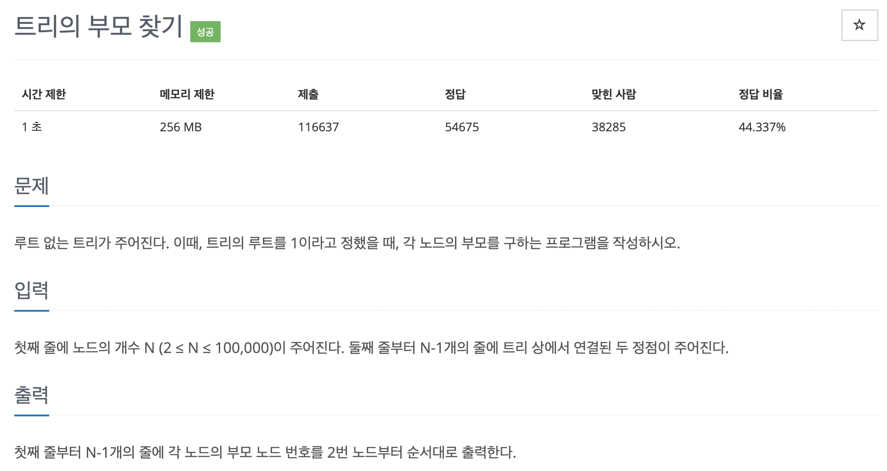

# 문제 070. 트리의 부모 찾기



### 내가 작성한 풀이

```java
메모리 77600KB, 시간 640ms

public class P11725_트리의부모찾기 {

	public static void main(String[] args) throws IOException {
		BufferedReader br = new BufferedReader(new InputStreamReader(System.in));
		BufferedWriter bw = new BufferedWriter(new OutputStreamWriter(System.out));
		StringTokenizer st;

		int N = Integer.parseInt(br.readLine());	// 노드의 개수

		ArrayList<Integer>[] adj = new ArrayList [N+1];		// 인접행렬
		for(int i=1; i<=N; i++) {
			adj[i] = new ArrayList<>();
		}

		for(int i=0; i<N-1; i++) {
			st = new StringTokenizer(br.readLine());
			int a = Integer.parseInt(st.nextToken());
			int b = Integer.parseInt(st.nextToken());

			// 두 정점을 연결
			adj[a].add(b);
			adj[b].add(a);
		}

		int[] parentNode = new int [N+1];	// 각 정점의 부모 노드를 저장하는 배열
		Queue<Integer> queue = new LinkedList<>();

		// 트리의 루트를 1로 지정 (문제 조건)
		queue.add(1);
		parentNode[1] = 1;

		while(!queue.isEmpty()) {
			int parent = queue.poll();

			for(int child : adj[parent]) {
				// 이미 방문했던 노드라면 pass
				if(parentNode[child] != 0) {
					continue;
				}

				parentNode[child] = parent;
				queue.add(child);
			}
		}

		// 출력
		for(int i=2; i<=N; i++) {
			bw.write(parentNode[i] + "\n");
		}

		bw.flush();
		bw.close();
	}
}
```

### 문제집 풀이

```java
메모리 203276KB, 시간 1640ms

public class P11725_트리의부모찾기 {

	static boolean[] visited;
	static ArrayList<Integer>[] tree;
	static int[] answer;

	public static void main(String[] args) {
		Scanner sc = new Scanner(System.in);
		int N = sc.nextInt();

		tree = new ArrayList [N+1];
		for(int i=0; i<tree.length; i++) {
			tree[i] = new ArrayList<>();
		}

		for(int i=1; i<N; i++) {
			int n1 = sc.nextInt();
			int n2 = sc.nextInt();
			tree[n1].add(n2);
			tree[n2].add(n1);
		}

		visited = new boolean [N+1];
		answer = new int [N+1];

		DFS(1);		// 부모 노드부터 DFS 시작

		for(int i=2; i<=N; i++) {
			System.out.println(answer[i]);
		}
	}

	private static void DFS(int number) {
		visited[number] = true;

		for(int i : tree[number]) {
			if(!visited[i]) {
				answer[i] = number;		// DFS를 탐색하면서 부모 노드를 정답 배열에 저장
				DFS(i);
			}
		}
	}
}
```
