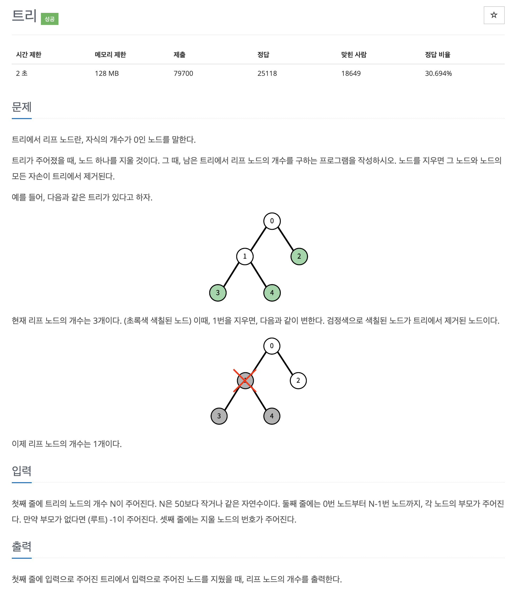

# 문제 071. 리프 노드의 개수 구하기



### 내가 작성한 풀이

```java
메모리 14256KB, 시간 104ms

public class P1068_리프노드 {

	static int[] parentNode;

	public static void main(String[] args) throws IOException {
		BufferedReader br = new BufferedReader(new InputStreamReader(System.in));

		int N = Integer.parseInt(br.readLine());	// 트리의 노드 개수
		parentNode = new int [N];		// 각 노드의 부모 노드 번호

		StringTokenizer st = new StringTokenizer(br.readLine());
		for(int i=0; i<N; i++) {
			parentNode[i] = Integer.parseInt(st.nextToken());
		}

		int removeNode = Integer.parseInt(br.readLine());	// 제거할 노드 번호
		remove(removeNode);

		// 리프 노드 판별
		boolean[] isParent = new boolean [N];
		for(int i=0; i<parentNode.length; i++) {
			int parent = parentNode[i];

			// 부모가 없거나(-1) 제거한 노드(-2)라면 pass
			if(parent < 0) {
				continue;
			}

			isParent[parent] = true;
		}

		// 리프 노드 세기
		int answer = 0;
		for(int i=0; i<N; i++) {
			// 제거한 노드라면 pass
			if(parentNode[i] == -2) {
				continue;
			}

			// 부모가 아니라면 리프 노드
			if(!isParent[i]) {
				answer++;
			}
		}

		System.out.println(answer);
	}

	private static void remove(int node) {
		parentNode[node] = -2;

		for(int i=0; i<parentNode.length; i++) {
			if(parentNode[i] == node) {
				remove(i);
			}
		}
	}
}
```

### 문제집 풀이

```java
메모리 17724KB, 시간 152ms

public class P1068_리프노드 {

	static ArrayList<Integer>[] tree;

	static int deleteNode;
	static boolean[] visited;
	static int answer = 0;

	public static void main(String[] args) {
		Scanner sc = new Scanner(System.in);
		int N = sc.nextInt();

		tree = new ArrayList [N];
		for(int i=0; i<N; i++) {
			tree[i] = new ArrayList<>();
		}

		int root = 0;
		for(int i=0; i<N; i++) {
			int p = sc.nextInt();

			if(p != -1) {
				tree[i].add(p);
				tree[p].add(i);
			} else {
				root = i;
			}
		}

		deleteNode = sc.nextInt();
		visited = new boolean [N];

		if(deleteNode == root) {
			System.out.println(0);
		} else {
			DFS(root);
			System.out.println(answer);
		}
	}

	private static void DFS(int number) {
		visited[number] = true;
		int cNode = 0;

		for(int i : tree[number]) {
			if(visited[i] == false && i != deleteNode) {	// 삭제 노드면 탐색 중지
				cNode++;
				DFS(i);
			}
		}

		if(cNode == 0) {
			answer++;		// 자식 노드가 없을 때 리프 노드로 간주하고 정답값 증가
		}
	}
}
```
