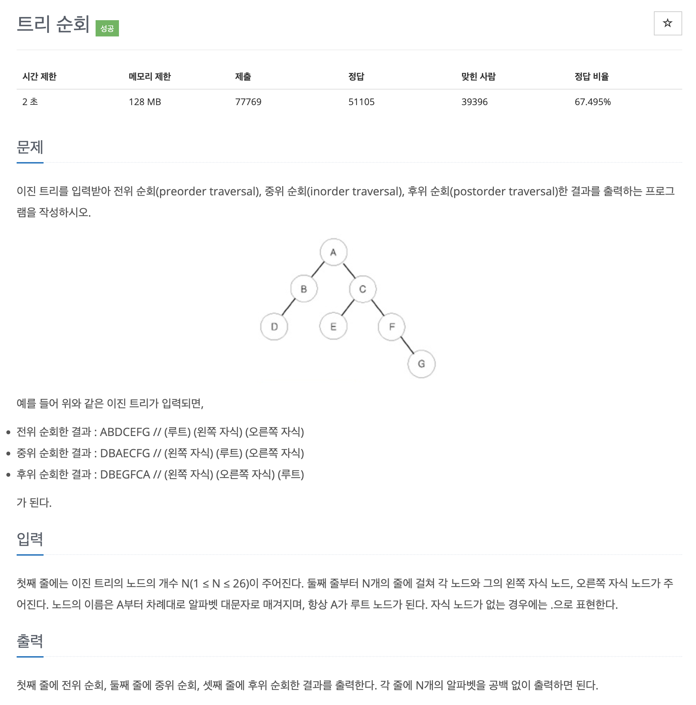

# 문제 073. 트리 순회하기



### 문제집 풀이 (이차원 배열)

```java
메모리 17700KB, 시간 152ms

public class P1991_트리순회 {

	static int[][] tree;

	public static void main(String[] args) {
		Scanner sc = new Scanner(System.in);
		int n = sc.nextInt();
		sc.nextLine();

		tree = new int [26][2];		// index -> 왼쪽 자식 노드(0) -> 오른쪽 자식 노드(1)
		for(int i=0; i<n; i++) {
			String[] temp = sc.nextLine().split(" ");
			int node = temp[0].charAt(0) - 'A';		// index로 변환하기 위해 A 문자 빼기
			char left = temp[1].charAt(0);
			char right = temp[2].charAt(0);

			// 자식 노드가 없을 때 -1 저장
			if(left == '.') {
				tree[node][0] = -1;
			} else {
				tree[node][0] = left - 'A';
			}

			if(right == '.') {
				tree[node][1] = -1;
			} else {
				tree[node][1] = right - 'A';
			}
		}

		preOrder(0);
		System.out.println();

		inOrder(0);
		System.out.println();

		postOrder(0);
		System.out.println();
	}

	private static void preOrder(int now) {
		if(now == -1) {
			return;
		}

		System.out.print((char) (now + 'A'));		// 1. 현재 노드
		preOrder(tree[now][0]);						// 2. 왼쪽 탐색
		preOrder(tree[now][1]);						// 3. 오른쪽 탐색
	}

	private static void inOrder(int now) {
		if(now == -1) {
			return;
		}

		inOrder(tree[now][0]);						// 1. 왼쪽 탐색
		System.out.print((char) (now + 'A'));		// 2. 현재 노드
		inOrder(tree[now][1]);						// 3. 오른쪽 탐색
	}

	private static void postOrder(int now) {
		if(now == -1) {
			return;
		}

		postOrder(tree[now][0]);					// 1. 왼쪽 탐색
		postOrder(tree[now][1]);					// 2. 오른쪽 탐색
		System.out.print((char) (now + 'A'));		// 3. 현재 노드
	}
}
```

### 추가 풀이 (클래스로 노드 구현)

```java
메모리 14212KB, 시간 104ms

public class P1991_트리순회 {

	static class Node {
		char value;
		Node left;
		Node right;

		Node(char value) {
			this.value = value;
		}
	}

	static Node[] tree;

	public static void main(String[] args) throws IOException {
		BufferedReader br = new BufferedReader(new InputStreamReader(System.in));
		StringTokenizer st;

		int n = Integer.parseInt(br.readLine());
		tree = new Node [26];

		for(int i=0; i<n; i++) {
			st = new StringTokenizer(br.readLine());
			char parent = st.nextToken().charAt(0);
			char left = st.nextToken().charAt(0);
			char right = st.nextToken().charAt(0);

			if(tree[parent - 'A'] == null) {
				tree[parent - 'A'] = new Node(parent);
			}

			if(left != '.') {
				if(tree[left - 'A'] == null) {
					tree[left - 'A'] = new Node(left);
				}

				tree[parent - 'A'].left = tree[left - 'A'];
			}

			if(right != '.') {
				if(tree[right - 'A'] == null) {
					tree[right - 'A'] = new Node(right);
				}

				tree[parent - 'A'].right = tree[right - 'A'];
			}
		}

		preorder(tree[0]);
		System.out.println();

		inorder(tree[0]);
		System.out.println();

		postorder(tree[0]);
		System.out.println();
	}

	/**
	 * 전위 순회 (현재 -> 왼쪽 -> 오른쪽)
	 */
	public static void preorder(Node node) {
		if(node == null) {
			return;
		}

		System.out.print(node.value);
		preorder(node.left);
		preorder(node.right);
	}

	/**
	 * 중위 순회 (왼쪽 -> 현재 -> 오른쪽)
	 */
	public static void inorder(Node node) {
		if(node == null) {
			return;
		}

		inorder(node.left);
		System.out.print(node.value);
		inorder(node.right);
	}

	/**
	 * 후위 순회 (왼쪽 -> 오른쪽 -> 현재)
	 */
	public static void postorder(Node node) {
		if(node == null) {
			return;
		}

		postorder(node.left);
		postorder(node.right);
		System.out.print(node.value);
	}
}
```
