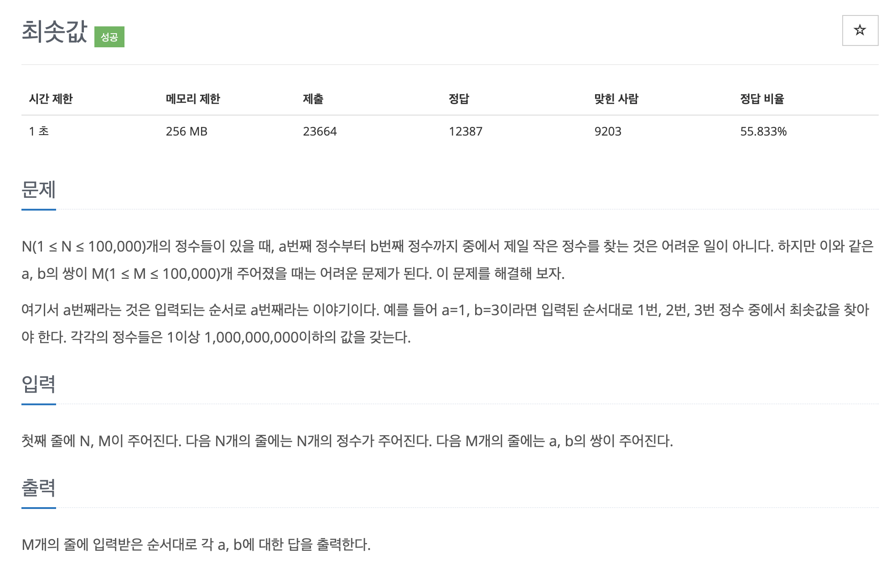

# 문제 075. 최솟값 찾기2



### 풀이 과정

1. 1차원 배열로 트리의 값을 최솟값 기준으로 초기화한다.  
   트리 배열 크기가 N = 10이므로 $2^k >= N$을 만족하는 k의 값은 4이고, 배열의 크기는 $2^4 * 2 = 32$가 된다. 시작 인덱스는 $2^4$ = start_index = 16이다.
2. 질의값 연산 함수를 수행하고, 결괏값을 출력한다.

### 문제집 풀이

```java
메모리 60600KB, 시간 1248ms

public class P10868_최솟값 {

	static long[] tree;

	public static void main(String[] args) throws IOException {
		BufferedReader br = new BufferedReader(new InputStreamReader(System.in));
		StringTokenizer st = new StringTokenizer(br.readLine());
		int N = Integer.parseInt(st.nextToken());	// 수의 개수
		int M = Integer.parseInt(st.nextToken());	// 구간의 최솟값을 구하는 횟수

		int treeHeight = 0;
		int length = N;
		while (length != 0) {
			length /= 2;
			treeHeight++;
		}

		int treeSize = (int) Math.pow(2, treeHeight + 1);
		int leftNodeStartIndex = treeSize / 2 - 1;

		// 트리 초기화하기
		tree = new long[treeSize + 1];
		for(int i=0; i<tree.length; i++) {
			tree[i] = Integer.MAX_VALUE;
		}

		// 데이터 입력받기
		for(int i = leftNodeStartIndex + 1; i <= leftNodeStartIndex + N; i++) {
			tree[i] = Long.parseLong(br.readLine());
		}

		setTree(treeSize - 1);	// tree 만들기

		for(int i=0; i<M; i++) {
			st = new StringTokenizer(br.readLine());
			int s = Integer.parseInt(st.nextToken());
			int e = Integer.parseInt(st.nextToken());
			s = s + leftNodeStartIndex;
			e = e + leftNodeStartIndex;
			System.out.println(getMin(s, e));
		}

		br.close();
	}

	private static long getMin(int s, int e) {	// 범위의 최솟값을 구하는 함수
		long min = Long.MAX_VALUE;

		while (s <= e) {
			if(s % 2 == 1) {
				min = Math.min(min, tree[s]);
				s++;
			}

			s = s/2;

			if(e % 2 == 0) {
				min = Math.min(min, tree[e]);
				e--;
			}

			e = e/2;
		}

		return min;
	}

	private static void setTree(int i) {	// 초기 트리를 구성하는 함수
		while (i != 1) {
			if (tree[i/2] > tree[i]) {
				tree[i/2] = tree[i];
			}

			i--;
		}
	}
}
```
